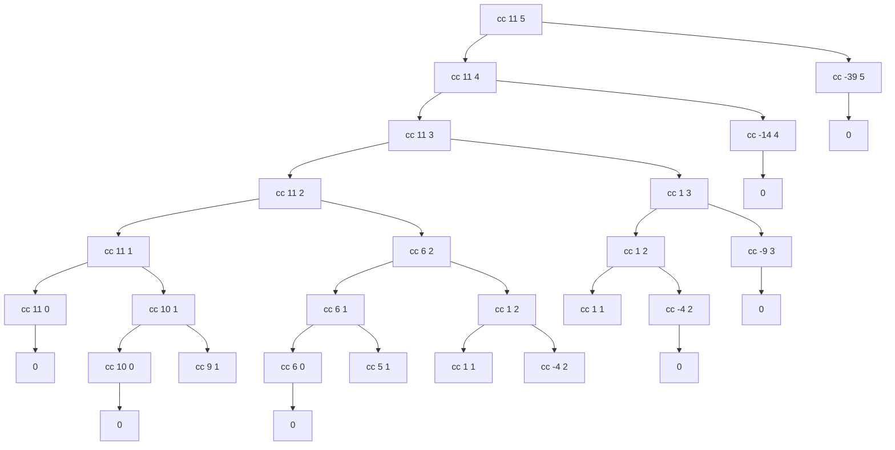

## Exercise 1.15

Partial call tree for `(count-change 11)`:

Full tree omitted — `cc amount 1` branches expand linearly to ~amount leaves.

**Order of growth:**
- Space: $\theta(n)$ — maximum depth of the tree is $n$ (reducing amount by 1 each step)
- Time: $\theta(n^k)$ — $k$ coin denominations each spawn a subtree of order $O(n^{k-1})$
