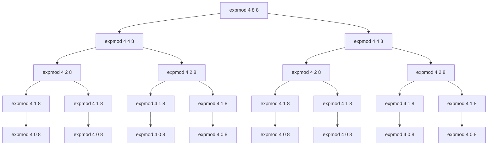

## Exercise 1.26

Partial call tree for `(expmod 4 8 8)`:

For `(expmod base exp m)`, total number of nodes is,
$1 + 2 + 4 + 8 + ... + 2 ^ n = 2 ^ {n+1} - 1$, where n is the total number of levels.

Total number of levels is when the nth level's exp becomes 1, i.e.
$$exp / (2 ^ n) = 1$$
$$n = log_2{exp}$$

So, total number of nodes is,
$$2 ^ {log_2(exp) + 1} - 1$$
$$2 * exp - 1$$

**Order of growth:**
- Space: $\theta(log(exp))$ — maximum depth of the tree is $log(exp)$
- Time: $\theta(exp)$ — each node spawn 2 more nodes
